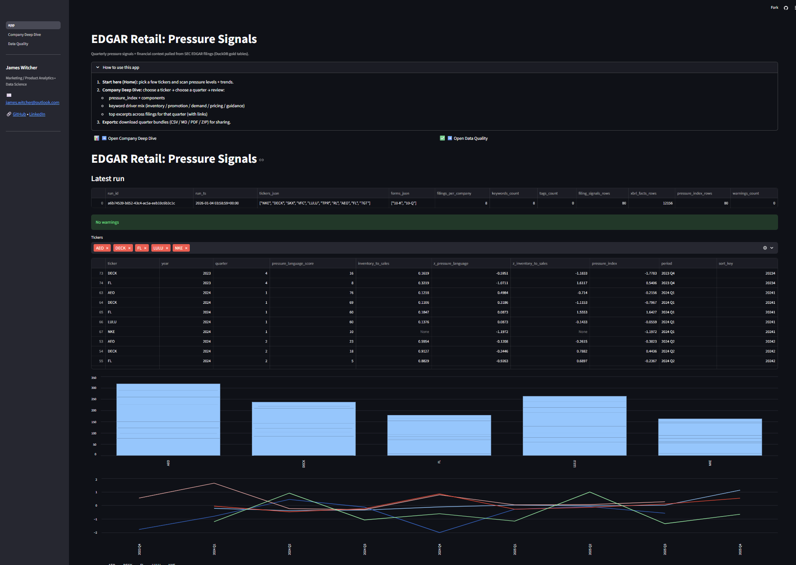
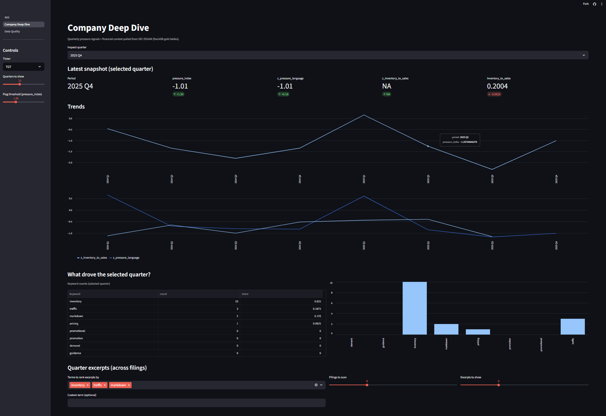
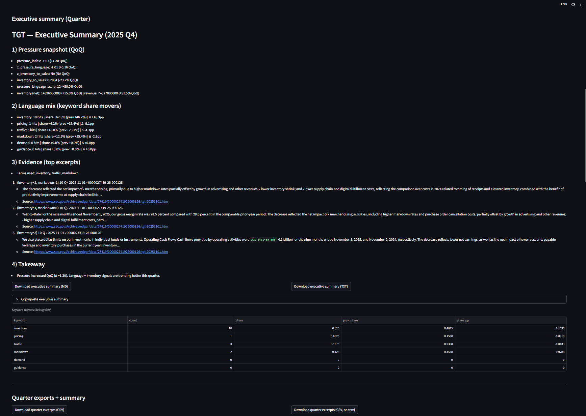
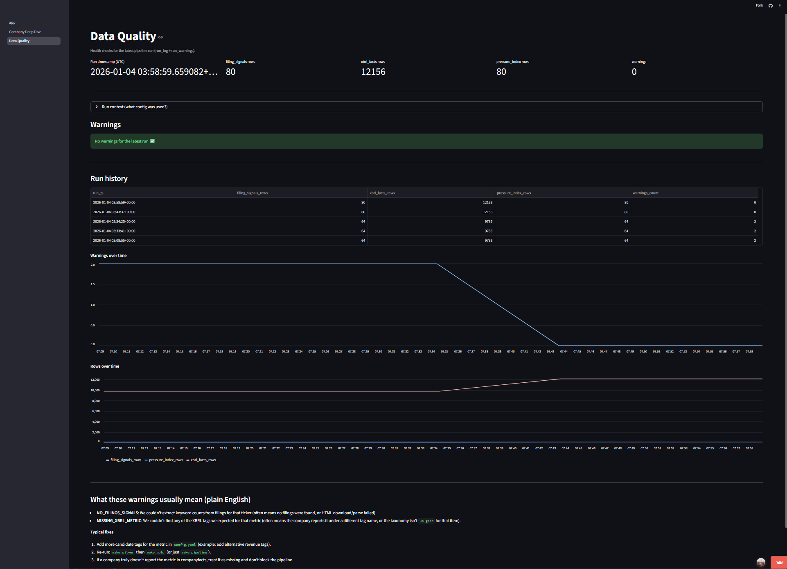

# EDGAR Retail ETL (Local-first, VS Code)

## Quickstart

```bash
make venv
make install
make ingest
make pipeline
make app
```


## Setup
```bash
python -m venv .venv
source .venv/bin/activate
pip install -r requirements.txt

cp config.example.yaml config.yaml
# edit config.yaml: sec.user_agent must include contact info
```


## Screenshoots

## Screenshots

### Home (Watchlist)


### Company Deep Dive




### Data Quality Checks

